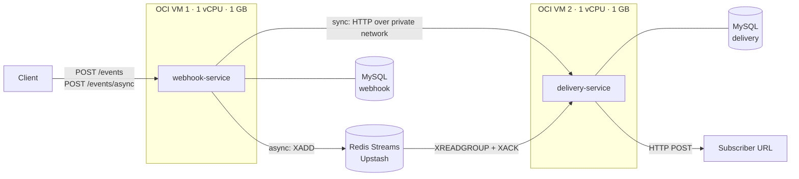
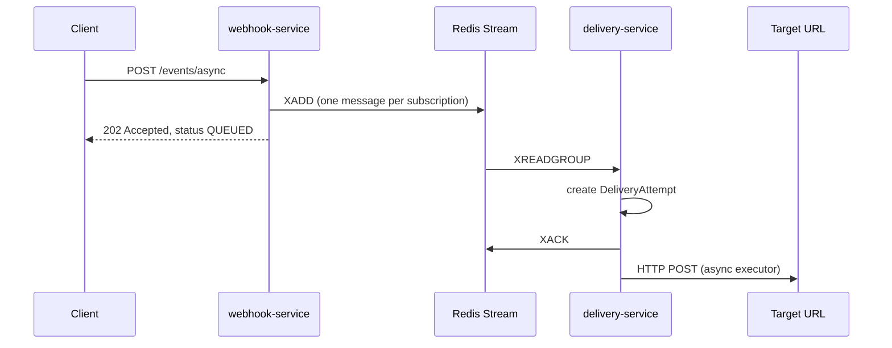

# Microservices Lab: Webhook Delivery System

> A deliberately small distributed system, built to study what changes when an application stops being a single process and becomes a set of independent services.

> **Resumo (PT-BR):** laboratório de sistemas distribuídos com dois serviços Spring Boot independentes, rodando em duas VMs na Oracle Cloud, que se comunicam por REST e por Redis Streams, cada um com o seu próprio banco. O objetivo é estudar o que muda quando uma aplicação deixa de ser um único processo: timeouts, falhas parciais, consistência eventual, retry e idempotência. É um projeto complementar ao [Kairos](https://github.com/arthsdev/kairos). A documentação completa dos experimentos está em inglês, abaixo.

This is the **main README of the lab**. It documents the whole system, every experiment and the decisions behind them. The second service lives in [delivery-service](https://github.com/arthsdev/delivery-service) and has a shorter README that links back here.

Companion to [**Kairos**](https://github.com/arthsdev/kairos), my full-stack portfolio project.

---

## Why this project exists

Kairos is a robust full-stack platform, but it is essentially one backend process with internal modules. This lab is the opposite on purpose: a tiny domain, so the complexity under study is the *distributed* kind (network calls, independent failures, data owned by different services, messages that arrive late, twice or not at all) and not business rules.

**The domain.** Clients register subscriptions (`eventType` → `targetUrl`), publish events, and the system delivers each event's payload to every matching target. That is all.

**Non-goals.** No frontend, no authentication, no payments, no heavy infrastructure (no Kubernetes, service mesh, Kafka, service discovery or API gateway). The size is the point.

---

## Architecture



| Service | Owns | Main endpoints |
|---|---|---|
| **webhook-service** (VM 1) | `subscriptions`, `events` | `POST /app/v1/subscriptions`, `POST /app/v1/events`, `POST /app/v1/events/async`, `GET /app/v1/events/{publicId}` |
| **delivery-service** (VM 2) | `delivery_attempts` | `POST /app/v1/deliveries`, plus the Redis Stream consumer |

**Deployment.** Each service is a jar running under `systemd` on its own OCI VM, reading its configuration from an `EnvironmentFile`. The VMs talk over OCI's private network. MySQL runs on Aiven (one separate instance per service) and Redis on Upstash, so neither consumes RAM on the 1 GB VMs.

**Observability (basic).** Logs through `journalctl`, one Actuator endpoint, and Swagger UI on both services. Real observability is still to come.

---

## Message contract

The contract between the two services is the **stream key and its fields**. No compiler checks it, so this repository is its source of truth and the delivery-service README repeats it with a pointer here.

| Item | Value |
|---|---|
| Stream key | `webhook.deliveries.requested` |
| Consumer group | `delivery-service` |
| Granularity | one message per *(event, subscription)* |

| Field | Meaning |
|---|---|
| `eventId` | public UUID of the event |
| `subscriptionId` | public UUID of the subscription |
| `targetUrl` | where the payload must be delivered |
| `payload` | event body, as a JSON string |
| `schemaVersion` | currently `1` |

The message is **self-sufficient on purpose**: the delivery-service cannot query the webhook-service's database, so everything it needs travels inside the message.

---

## Experiments

| # | Experiment | Status |
|---|---|---|
| 1 | Synchronous REST between two independent services | Done |
| 2 | Database per service | Done |
| 3 | Asynchronous events with Redis Streams | Done |
| 4 | Service unavailable (delivery-service down) | Planned |
| 5 | Broker unavailable (Redis down) | Planned |
| 6 | Retry of failed and pending messages | Planned |
| 7 | Idempotency and duplicate messages | Planned |
| 8 | Eventual consistency, observed explicitly | Planned |
| 9 | Transactional Outbox | Planned |

### Experiment 1: Synchronous REST

**Question:** what actually changes when a local method call becomes a network call?

**Flow.** `POST /app/v1/events` creates the event, looks up the active subscriptions for its `eventType`, and calls the delivery-service over HTTP once per subscription. The delivery-service stores a `DeliveryAttempt`, hands it to an asynchronous executor and performs the HTTP delivery to the target.

**What the code does about failure.** `DeliveryServiceClient` catches `RestClientException` and returns a result instead of throwing. `EventDispatcher` counts accepted calls and maps the outcome to the event status:

| Accepted calls | Event status |
|---|---|
| none to send | `NO_SUBSCRIBERS` |
| all | `DISPATCHED` |
| some | `PARTIALLY_DISPATCHED` |
| none | `DISPATCH_FAILED` |

Both services expose OpenAPI documentation (Swagger UI) and have automated tests: unit tests with Mockito and integration tests with Testcontainers running a real MySQL (24 tests in this service and 13 in the delivery-service at the time of writing).

### Experiment 2: Database per service

Each service owns its own MySQL instance and its own Flyway migrations. They never read each other's tables and share only the HTTP contract and the message contract.

- References across the boundary use **public UUIDs** (`event_id`, `subscription_id`) with no foreign keys. Technical `BIGINT` ids stay internal to each database.
- Data a service needs from the other (`target_url`, `payload`) **travels inside the request or message and is stored as a copy**.
- Because the databases are physically separate, one service's credentials cannot see the other's schema. The rule is enforced by the infrastructure, not by discipline.

**The cost, stated honestly.** There are no joins and no transactions across the boundary. Every consequence below has its own experiment: the event status that never changes, the publish-then-save race, duplicated deliveries and the same data stored in two places.

**A decision that changed.** The initial plan was SQLite per service to save RAM. I moved to managed MySQL because it keeps the database off the 1 GB VMs, survives a VM restart, and lets the tests run against a real MySQL with Testcontainers. The price is network latency to the database: Flyway alone takes a few seconds at boot.

### Experiment 3: Asynchronous events (Redis Streams)

**Question:** what changes when the webhook-service stops calling the delivery-service and publishes an event instead?

**Flow**



**Decisions**

| Decision | Why |
|---|---|
| Separate endpoint (`/events/async`) instead of a `deliveryMode` flag | The two paths have different guarantees and different responses (`201` vs `202`); a flag would hide that. |
| New `QUEUED` status instead of reusing `DISPATCHED` | `DISPATCHED` means "the delivery-service accepted the request". `QUEUED` means "the broker accepted the message". One status should not mean two things. |
| One message per *(event, subscription)* | The consumer stays simple, retries affect only the failed delivery, and `(eventId, subscriptionId)` is a natural idempotency key. |
| Consumer group + explicit `XACK` | The service resumes where it stopped after a restart, and a message is only confirmed after the work is done. |
| Reuse `DeliveryAttemptService.create()` | The consumer is just another entry point to the same use case as the HTTP controller; `DeliveryProcessor` is untouched. |
| Managed Redis (Upstash, TLS) | Keeps the 1 GB VMs light and gives me a second messaging style next to RabbitMQ in Kairos. |
| Long poll timeout (10 s) | Each blocking read counts as a command on the free tier. |

**What the consumer does with each message**

| Situation | Action | Reason |
|---|---|---|
| `create()` succeeds | `XACK` | the work is done |
| `create()` throws (for example the database is down) | **no** `XACK` | it may succeed later, so the message stays pending |
| Malformed or invalid message | log an error, `XACK`, discard | it can never succeed; leaving it pending forever helps nobody |

**Evidence**

The publisher logs the record id. Notice the order: the message is in the stream *before* the event row is inserted.

```text
DEBUG EventStreamPublisher : Published to stream [key=webhook.deliveries.requested, recordId=1791239181616-0, eventId=37bffd55-..., subscriptionId=a057dc0f-...]
Hibernate: insert into events (created_at,event_type,payload,public_id,status) values (?,?,?,?,?)
```

- `POST /events/async` returns `202` with `"status":"QUEUED"`.
- Locally, about 2 s passed between the `XADD` and the consumer receiving the message (Upstash is in N. Virginia). The 10 s poll timeout adds no latency, because a blocking read returns as soon as an entry arrives.
- In production (VM 1 → Upstash → VM 2) the payload reached the target URL and `XPENDING webhook.deliveries.requested delivery-service` returned no pending messages.
- On the 1 GB VM the delivery-service takes about 62 s to boot (17 s on my machine), and the first `/v3/api-docs` call takes about 3.8 s before the cache warms up.

**What I learned**

- The poll timeout is a **cost** knob, not a latency knob: a blocking read returns as soon as an entry arrives, so the 10 s timeout added no measurable latency and only reduced the number of empty commands.
- Acknowledge **after** the work, and treat the three outcomes differently. "Failed and retryable" and "failed and hopeless" need opposite handling.
- The dual write is not just theory: it is visible in a single log excerpt, in the wrong order.
- Spring wraps Redis errors, so a `BUSYGROUP` on the second boot is in the *cause chain*, not in the top exception's message. Checking only the message would have broken the second startup.
- Beans that need external infrastructure need an off switch for tests (`event-stream.consumer.enabled=false`), and integration tests should get a fake broker URL instead of the real one.
- A status can only describe what this service knows. `QUEUED` stays `QUEUED` after a successful delivery because the real outcome lives in the other service's database.

---

## Security notes

- The delivery-service port is open only to the webhook-service's private address and to my own IP. The webhook-service is public so the API and Swagger can be demonstrated.
- **There is no authentication, by design** (it is a non-goal of the lab). A consequence worth knowing: anyone who can reach the webhook-service can register an arbitrary `targetUrl`, which makes the system an open HTTP caller. Documented, not fixed.

---

## Known limitations (and which experiment addresses each)

| Limitation | Experiment |
|---|---|
| **Dual write:** the message is published before the event row is saved. A crash in between leaves a message for an event that does not exist. | 9 |
| **`QUEUED` never changes** on this side, even after a successful delivery. | 8 |
| **Pending messages are not redelivered.** The group reads with `lastConsumed()`, so a message left pending (failed `create()`, crash) is never retried. | 6 |
| **Duplicate window:** a crash between `create()` and `XACK`, or a failed `XACK`, redelivers the message and creates a second `DeliveryAttempt`. There is no unique constraint on `(event_id, subscription_id)` yet. | 7 |
| **`XACK` means "persisted", not "delivered".** The HTTP delivery runs asynchronously after `create()`. | 6, 8 |
| **Redis down at boot** stops the delivery-service from starting at all, HTTP endpoints included. Behavior on read errors while running is untested. | 5 |
| **Malformed messages are discarded**, with no dead-letter stream. | 6 |
| **Publish timeouts** are at their defaults, so an unreachable Redis could hold an HTTP request open. | 5 |

---

## Running locally

Requirements: JDK, Maven, Docker (Testcontainers), a MySQL database and a Redis instance.

```bash
cp .env.example .env   # fill in the values
mvn test
mvn spring-boot:run
```

| Variable | Purpose |
|---|---|
| `DB_HOST`, `DB_PORT`, `DB_NAME`, `DB_USER`, `DB_PASSWORD` | this service's MySQL |
| `DELIVERY_SERVICE_URL` | base URL of the delivery-service (sync path) |
| `REDIS_URL` | `rediss://...` URL of the Redis instance |
| `EVENT_STREAM_DELIVERIES_KEY` | optional override of the stream key |

The delivery-service must use the **same** `REDIS_URL` and stream key. If the two keys differ, the consumer reads an empty stream and nothing fails visibly.

Swagger UI: `http://localhost:8080/swagger-ui.html`

---

## Stack

Java, Spring Boot 4.1 (Spring MVC, Spring Data JPA, Spring Data Redis), MySQL on Aiven, Flyway, Redis Streams on Upstash, SpringDoc OpenAPI, Mockito, Testcontainers, Maven, Linux, `systemd`, Oracle Cloud Infrastructure.